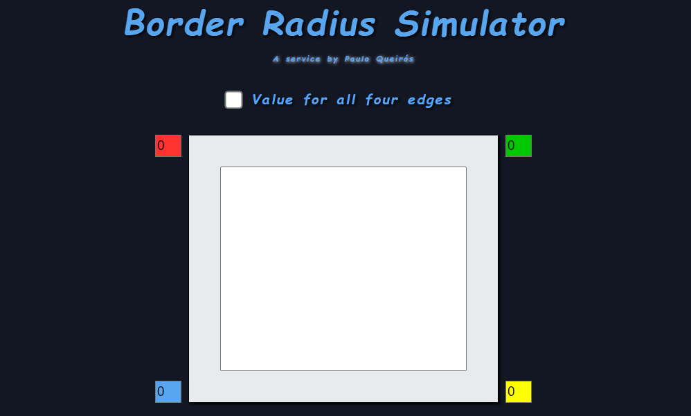

# Border-Simulator

link: https://bordersimulator.netlify.app/

> A propriedade border-radius pode ter vários valores alterados. Visualize a aparência da forma ao alterar esses valores.

## Usage example

Entre com os valores desejados em cada aresta do elemento apara conseguir visualizar o resultado.

## Contato

Paulo Queirós – paulogomes.queiros@gmail.com
